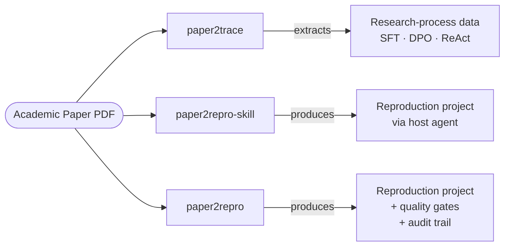

<div align="center">

# Papyrus

**A toolkit for engineering academic papers**

*Extract the research process. Reproduce the paper as code. Audit the pipeline.*

[](./LICENSE)


[](https://github.com/HKUDS/DeepCode)

[**Three Tools**](#the-three-tools) · [**Quick Start**](#quick-start) · [**Examples**](#examples) · [**Architecture & Lineage**](#architecture--lineage)

</div>

---

## Why Papyrus

Most paper-to-code projects optimize for one thing: generating code from a
paper. Papyrus treats *paper engineering* as three distinct jobs and ships a
purpose-built tool for each — sharing a worldview, but never sharing a
runtime.

> Papers are not just text to read.
> They contain a research process worth structuring — and a research process is data.

## The three tools



| Tool | Form | What it does |
|------|------|--------------|
| **[`paper2trace`](./paper2trace/)** | Standalone Python script | Extracts the implicit research process from a paper (hypothesis chains, critical analysis, decisions) and emits structured artifacts including SFT / DPO / ReAct trace data. |
| **[`paper2repro-skill`](./paper2repro-skill/)** | Claude Code / Codex skill | Lightweight paper reproduction that runs *inside* an existing agent. Produces runnable code, evaluation scripts, and a claim-by-claim reproduction report. |
| **[`paper2repro`](./paper2repro/)** | Self-hosted multi-agent server | Heavier paper reproduction with its own multi-agent runtime, quality gates (artifact contract / type check / reproduction gate / auto-repair), web UI, and trajectory logging in Anthropic `rich_messages` format. |

> `paper2repro` and `paper2repro-skill` are **not** lite/pro tiers of the same
> product. They are two architectural shapes of the same job — the skill borrows
> the host agent (Claude Code / Codex); the server runs its own. Use the skill
> when you have an agent host and want a fast result. Use the server when you
> want a self-contained, audited, visualizable run with explicit quality gates.

## Quick Start

Each tool installs and runs independently. Pick the one that matches your need:

<details>
<summary><b>paper2trace</b> — extract research-process data from a paper</summary>

```bash
cd paper2trace
pip install python-docx pdfplumber anthropic openai
cp .env.example .env             # fill in API keys / model
python paper2trace.py /path/to/paper.pdf
# output -> paper2trace/output/<paper_id>/
```

Full reference: [paper2trace/README.md](./paper2trace/README.md)

</details>

<details>
<summary><b>paper2repro-skill</b> — reproduce a paper inside Claude Code</summary>

```bash
mkdir -p ~/.claude/skills/paper2repro
cp paper2repro-skill/SKILL.md     ~/.claude/skills/paper2repro/
cp -r paper2repro-skill/scripts   ~/.claude/skills/paper2repro/
```

Then inside Claude Code:

```text
/paper2repro pdf_path=/absolute/path/to/paper.pdf
```

Full reference: [paper2repro-skill/README.md](./paper2repro-skill/README.md)

</details>

<details>
<summary><b>paper2repro</b> — self-hosted multi-agent server</summary>

```bash
cd paper2repro
pip install -r requirements.txt
cp config.yaml.example config.yaml                       # set LLM provider
cp deepcode_config.json.example deepcode_config.json     # set provider keys

# CLI
python paper2repro.py --pdf /path/to/paper.pdf

# Web UI (optional)
cd frontend && npm install && npm run build && cd ..
python serve.py                                          # http://localhost:8000
```

Full reference: [paper2repro/README.md](./paper2repro/README.md)

</details>

## Examples

End-to-end examples live in [`examples/`](./examples/).

The `boyer_moore_*` set demonstrates a Level-3 reproduction (algorithm +
experiment trend) of **Boyer & Moore 1977 — A Fast String Searching Algorithm**:

| Artifact | Path |
|---|---|
| Paper PDF | [`examples/boyer_moore_source/boyer_moore.pdf`](./examples/boyer_moore_source/boyer_moore.pdf) |
| `paper2trace` output (9 files including SFT / DPO / ReAct) | [`examples/boyer_moore_trace/`](./examples/boyer_moore_trace/) |
| `paper2repro-skill` output (runnable project + report) | [`examples/boyer_moore_skill/`](./examples/boyer_moore_skill/) |
| Reproduction report | [`examples/boyer_moore_skill/REPRODUCTION_REPORT.md`](./examples/boyer_moore_skill/REPRODUCTION_REPORT.md) |
| Agent trajectory | [`examples/boyer_moore_skill/agent_trace.jsonl`](./examples/boyer_moore_skill/agent_trace.jsonl) |

## Architecture & Lineage

`paper2trace` and `paper2repro-skill` are original to this repository.

`paper2repro` is a fork of [HKUDS/DeepCode](https://github.com/HKUDS/DeepCode)
(MIT). It retains DeepCode's multi-agent + MCP scaffolding (`core/`, `tools/`,
most of `workflows/`) and adds the following capabilities on top:

<table>
<tr><td>

**Pipeline additions**
- Critique stage (老师傅批判) inserted before code planning
- Structured `must_implement` / `traps` / `external_deps` extraction

</td><td>

**Quality system**
- Artifact-contract validation
- Type-check gate (mypy integration)
- Reproduction gate (post-impl validation)
- Auto-repair loop on gate failures

</td></tr>
<tr><td>

**Observability**
- Per-task `events.jsonl` event stream
- Structured `llm.jsonl` / `mcp.jsonl` records
- Trajectory in Anthropic `rich_messages` format

</td><td>

**Surfaces**
- FastAPI + SSE event-stream backend
- React web UI (task list, replay, trajectory viewer)
- Offline demo HTML bundles for sharing

</td></tr>
</table>

Full per-file diff against upstream is documented in
[`paper2repro/NOTICE.md`](./paper2repro/NOTICE.md).

## Repository layout

```text
papyrus/
├── paper2trace/           ← research-process extractor
├── paper2repro-skill/     ← Claude Code skill
├── paper2repro/           ← self-hosted multi-agent server (fork of DeepCode)
├── examples/              ← Boyer-Moore end-to-end demo
├── LICENSE                ← MIT (retains DeepCode copyright)
└── README.md              ← this file
```

Each subdirectory ships its own README. The three tools share this repo and
license but evolve independently.

## License

[MIT](./LICENSE). DeepCode's original copyright notice is retained alongside
this fork's copyright.

---

<div align="center">

*Built with care · Honest about its lineage · Designed for paper engineering*

</div>
